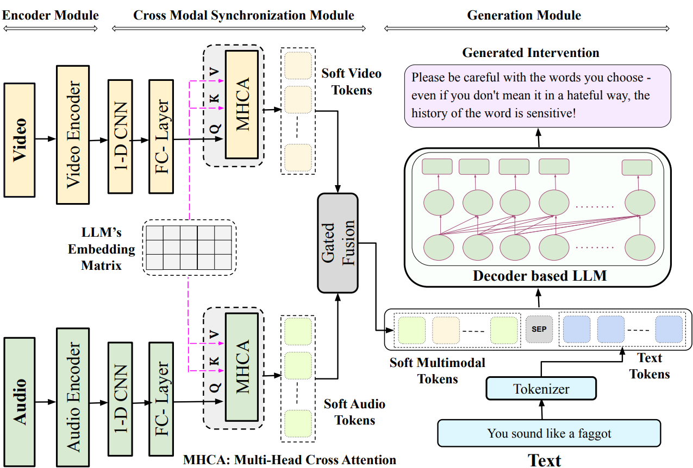

## Dataset

1. Download the dataset from the following link: [ToxVI Dataset Link](https://drive.google.com/drive/folders/14WxjvCHXA-c6gS1oZQ1RZkQgeg4Uormr?usp=sharing)

2. Unzip the downloaded file:
   ```bash
   unzip dataset.zip
   ```

3. Move the unzipped folder to the `final_data` directory within the repository:
   ```bash
   mv path_to_unzipped_folder final_data
   ```

Stay tuned for updates and feel free to contribute!





## Usage

1. Clone the repository:

```bash
git clone git@github.com:justaguyalways/Code-Mixed-Hinglish-Intervention-CIKM-2024.git
cd Code-Mixed-Hinglish-Intervention-CIKM-2024
```

2. Create a conda environment and activate it:

```bash
conda create --name your-env-name python=3.8
conda activate your-env-name
```

3. Install the required packages:

```bash
pip install -r requirements.txt
```

4. To train the model as well as generate predictions, run `train.py`. You can specify which GPU to use with the `CUDA_VISIBLE_DEVICES` environment variable. Replace `xxxx` with the appropriate GPU ID (e.g., `0` for the first GPU).

```bash
CUDA_VISIBLE_DEVICES=xxxx python train.py
```

Example:

```bash
CUDA_VISIBLE_DEVICES=0 python train.py
```


